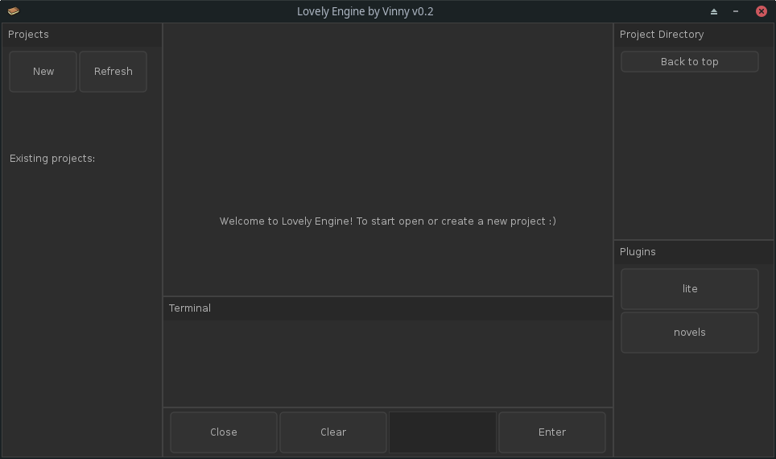
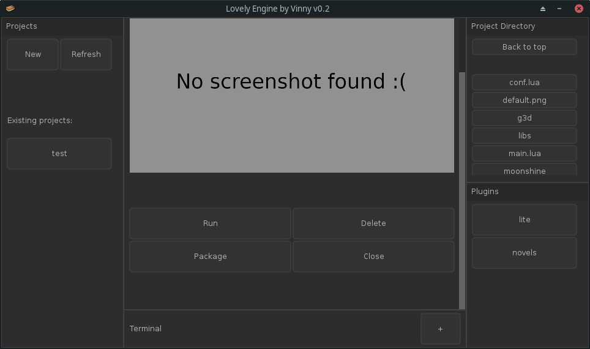

# Lovely Engine

Lovely Engine allows you to create and manage your Love2d projects from a nice gui, without losing the charm of a gui-less game engine.

## Screenshots




## Installation

To install it, first make sure you're running a **64-bit Linux** distribution, 32-bit support is planned for the future though, then run this command:

```
$ git clone https://github.com/vinnyhorgan/lovely-engine && cd lovely-engine && chmod 777 run.sh installer.sh
```

Then you can run ```$ ./installer.sh``` to open the plugin installer and ```$ ./run.sh``` to launch Lovely Engine.

## Plugins

For now there are two official plugins:

#### Lite

The lite plugin allows you to launch the [lite editor](https://github.com/rxi/lite) in your project directory with the click of a button, to do so simply press the plugin button while a project is open.

#### Novels

Novels is a work-in-progress plugin that let's you easily create visual novels through the use of a **scripting language**. It's still not ready but you can mess around with it if you want (and open pull requests :)). To use it just press the "new" button and insert a name, but instead of clicking the "create" button, click the novels plugin one. To test the demo press the "run" button.

## Dependencies

This project would have never been possible without the use of:
- [Love2d](https://love2d.org) obviously, the heart of the whole project.
- [love-nuklear](https://github.com/keharriso/love-nuklear) an adaptation of the awesome nuklear library for lua.
- [log.lua](https://github.com/rxi/log.lua) for logging.
- [love.js](https://github.com/Davidobot/love.js) for exporting to the web.
- And the many libraries included in the project template!
